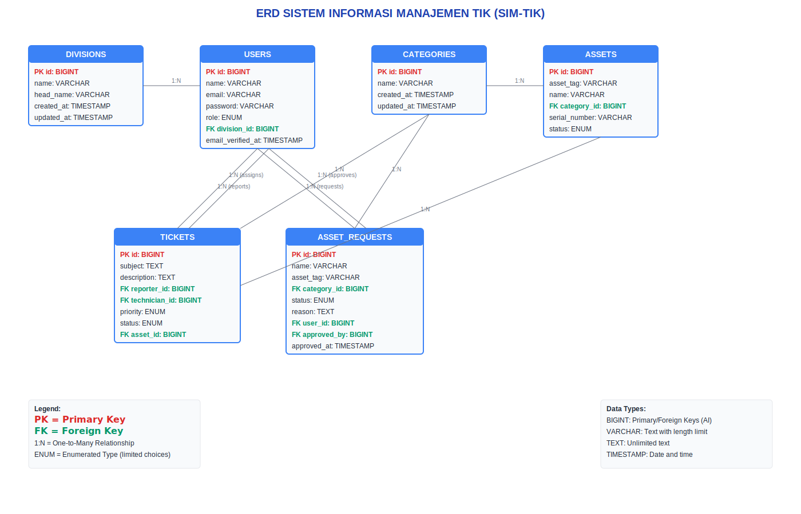

# 🚔 SIM-TIK - Sistem Informasi Manajemen TIK Polres Garut

## Konsep Dari Web Yang Saya Buat

SIM-TIK adalah Sistem Informasi Manajemen Teknologi Informasi dan Komunikasi yang dikembangkan khusus untuk Kepolisian Resor Garut. Sistem ini dirancang untuk mengelola aset TIK, tiket support, dan permintaan aset secara terintegrasi. SIM-TIK bertujuan untuk meningkatkan efisiensi pengelolaan infrastruktur TIK di lingkungan Polres Garut dengan proses yang terstruktur, transparan, dan mudah diakses.

---

## 🌐 Lokasi Polres Garut

**📍 Alamat:** Jl. Jendral Sudirman No.204, Sucikaler, Kec. Karangpawitan, Kabupaten Garut, Jawa Barat 44182  
**📞 Telepon:** (0262) 236415  
**🌐 Website:** [www.polres-garut.polri.go.id](https://www.polres-garut.polri.go.id)

---

## 🎯 Fitur Yang Tersedia

### 🔐 Authentication & Login
- **Login Page** dengan branding POLRES Garut
- **Multi Role Authentication** (Admin, Teknisi, User)
- **Email Verification** untuk keamanan
- **Password Reset** jika lupa password

### 👨‍💼 Dashboard Admin
- **Overview Dashboard** dengan statistik lengkap
- **Manajemen Users** (Admin, Teknisi, User)
- **Manajemen Aset** TIK lengkap
- **Manajemen Kategori** aset
- **Manajemen Tiket** support
- **Approval Asset Request**

### 🔧 Dashboard Teknisi  
- **Tiket Assignment** otomatis
- **Status Tracking** tiket
- **Asset Management** terbatas
- **Report Generation**

### 👤 Dashboard User
- **Pengajuan Asset** request
- **Tracking Status** pengajuan
- **Tiket Support** creation
- **Profile Management**

### 📋 Tiket Management
- **Create Ticket** untuk laporan masalah
- **Status Tracking** (Pending, Processing, Resolved)
- **Priority Levels** (Low, Medium, High, Critical)
- **Assignment System** ke teknisi
- **History Log** lengkap

### 🖥️ Asset Management
- **Asset Registration** dengan barcode
- **Category Management** (Laptop, PC, Printer, dll)
- **Status Tracking** (Baik, Rusak Ringan, Rusak Berat)
- **Location Management**
- **Maintenance History**

---

## 👥 Multi User System

### 🔵 Admin
- **Full Access** ke semua fitur
- **User Management** lengkap
- **Asset Management** penuh
- **Ticket Oversight** semua tiket
- **Report Generation** lengkap
- **System Configuration**

### 🟢 Teknisi  
- **Ticket Assignment** otomatis
- **Asset Viewing** terbatas
- **Status Updates** tiket
- **Maintenance Records**
- **Technical Reports**

### 🟡 User
- **Asset Request** submission
- **Ticket Creation** untuk laporan
- **Status Tracking** pengajuan
- **Profile Management**
- **Limited Viewing** aset

---

## 🗄️ Database Structure

### 📊 Entity Relationship Diagram (ERD)



**Tabel Utama:**
- **users** - Data pengguna dengan role-based access
- **divisions** - Struktur organisasi
- **categories** - Kategori aset TIK
- **assets** - Data aset lengkap
- **tickets** - Tiket support system
- **asset_requests** - Pengajuan aset baru

**Relasi Database:**
- One-to-Many antar tabel dengan foreign keys
- Cascade delete untuk data integrity
- Index optimization untuk performance

---

## 🔑 Akun Default

### 👨‍💼 Admin
- **Email:** admin@simtik.com
- **Password:** password
- **Role:** Administrator

### 🔧 Teknisi
- **Email:** teknisi@simtik.com  
- **Password:** password
- **Role:** Technician

### 👤 User
- **Email:** user@simtik.com
- **Password:** password
- **Role:** User

---

## 🛠️ Teknologi yang Digunakan

- **Laravel 11** - PHP Framework
- **Tailwind CSS** - CSS Framework
- **MySQL** - Database Management
- **Blade Templates** - Template Engine
- **Authentication System** - Laravel Breeze
- **Role-Based Access Control** - Custom Middleware

---

## 🛠️ Tools yang Digunakan

- **XAMPP** - Web Server Environment
- **VS Code** - Code Editor
- **phpMyAdmin** - Database Management
- **Git** - Version Control
- **GitHub** - Code Repository

---

## 📋 Persyaratan untuk Instalasi

- **PHP 8.2+**
- **Web Server** (Apache/Nginx)
- **Database** (MySQL 5.7+/8.0+)
- **Composer** Package Manager
- **Node.js & NPM** untuk asset compilation
- **Web Browser** modern

---

## 🚀 Cara Instalasi

### 1. Persyaratan
Pastikan terlebih dulu Anda memenuhi persyaratan berikut:
- PHP versi 8.2 atau lebih tinggi
- Web Server (Apache/Nginx)
- Database (MySQL)
- Composer terinstall

### 2. Clone Repository
Pertama, clone repository dari GitHub dengan perintah berikut:

```bash
git clone https://github.com/fadilfauzi/sim-tik-ujikom.git
```

### 3. Masuk ke Direktori Proyek
Setelah clone selesai, masuk ke direktori proyek:

```bash
cd sim-tik-ujikom
```

### 4. Instalasi Dependensi
Instal dependensi PHP menggunakan Composer:

```bash
composer install
```

Instal dependensi JavaScript menggunakan NPM:

```bash
npm install
npm run build
```

### 5. Salin File .env
Salin file `.env.example` menjadi `.env`:

```bash
cp .env.example .env
```

### 6. Atur Kunci Aplikasi
Generate kunci aplikasi menggunakan Artisan:

```bash
php artisan key:generate
```

### 7. Konfigurasi Database
Edit file `.env` dan atur konfigurasi database:

```env
DB_CONNECTION=mysql
DB_HOST=127.0.0.1
DB_PORT=3306
DB_DATABASE=sim_tik
DB_USERNAME=root
DB_PASSWORD=
```

### 8. Jalankan Migrations
Jalankan perintah berikut untuk membuat tabel di database:

```bash
php artisan migrate
```

### 9. Seed Data (Opsional)
Untuk data awal, jalankan seeder:

```bash
php artisan db:seed
```

### 10. Jalankan Server
Jalankan server lokal dengan perintah berikut:

```bash
php artisan serve
```

Aplikasi akan tersedia di `http://127.0.0.1:8000`

---

## 🎨 Design & UI/UX

### 🌟 Features
- **Responsive Design** untuk mobile & desktop
- **Modern UI** dengan Tailwind CSS
- **Dark Mode Support** (opsional)
- **Smooth Animations** dan transisi
- **POLRES Branding** dengan logo resmi
- **Accessibility** compliant

### 🎯 User Experience
- **Intuitive Navigation** yang mudah digunakan
- **Fast Loading** dengan optimization
- **Error Handling** yang user-friendly
- **Form Validation** real-time
- **Mobile Friendly** interface

---

## 📊 Screenshots

### 🔐 Login Page
- Logo POLRES Garut sebagai background lingkaran
- Informasi lengkap Polres Garut
- Link interaktif ke Google Maps, telepon, dan website

### 📱 Dashboard
- Overview dengan statistik real-time
- Quick access ke fitur utama
- Responsive design untuk berbagai device

---

## 🔒 Security Features

- **Authentication System** dengan Laravel Breeze
- **Role-Based Access Control** (RBAC)
- **CSRF Protection** untuk forms
- **XSS Protection** dengan escaping
- **SQL Injection Protection** dengan Eloquent ORM
- **Password Hashing** dengan bcrypt

---

## 📝 Documentation

- **[ERD Database](ERD_SIM-TIK.md)** - Dokumentasi lengkap database
- **[API Documentation](docs/api.md)** - Endpoint API (jika ada)
- **[User Guide](docs/user-guide.md)** - Panduan pengguna

---

## 🤝 Contributing

1. Fork repository ini
2. Buat branch baru (`git checkout -b feature/AmazingFeature`)
3. Commit perubahan (`git commit -m 'Add some AmazingFeature'`)
4. Push ke branch (`git push origin feature/AmazingFeature`)
5. Buka Pull Request

---

## 📞 Support

Untuk bantuan teknis atau pertanyaan, hubungi:

**🏢 POLRES GARUT**
- **Alamat:** Jl. Jendral Sudirman No.204, Karangpawitan
- **Telepon:** (0262) 236415
- **Website:** www.polres-garut.polri.go.id

---

## 📄 License

Proyek ini dilisensikan under the MIT License - lihat file [LICENSE](LICENSE) untuk detail.

---

## ⭐ Acknowledgments

- **POLRES GARUT** - Institusi kepolisian terhormat
- **Laravel Team** - Framework PHP yang powerful
- **Tailwind CSS** - CSS framework modern
- **Open Source Community** - Kontributor dan developer

---

<div align="center">

## 🚔 **SIM-TIK - Polres Garut**  

**Sistem Informasi Manajemen TIK untuk Pelayanan Lebih Baik**

[](https://github.com/fadilfauzi/sim-tik-ujikom/stargazers)
[](https://github.com/fadilfauzi/sim-tik-ujikom/network)
[](https://github.com/fadilfauzi/sim-tik-ujikom/issues)
[](https://opensource.org/licenses/MIT)

</div>
